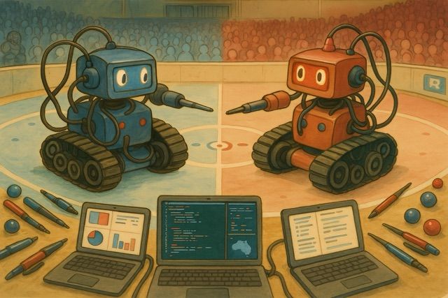
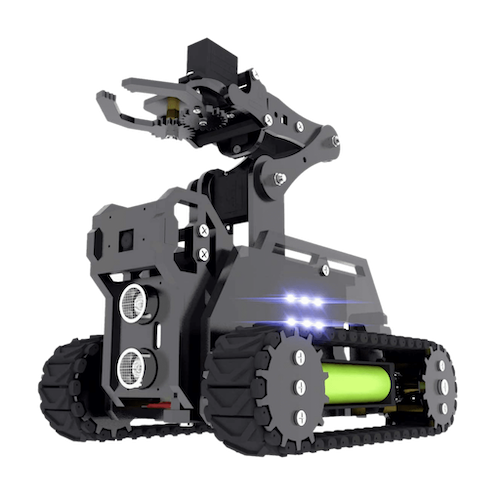
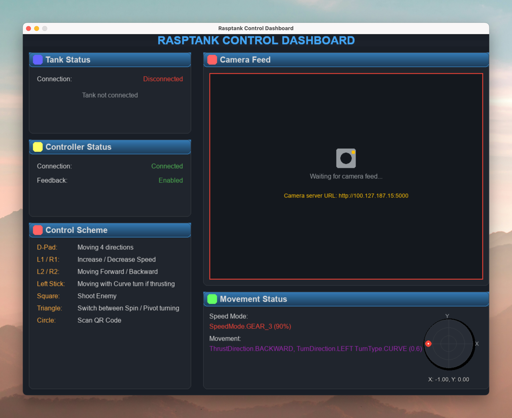
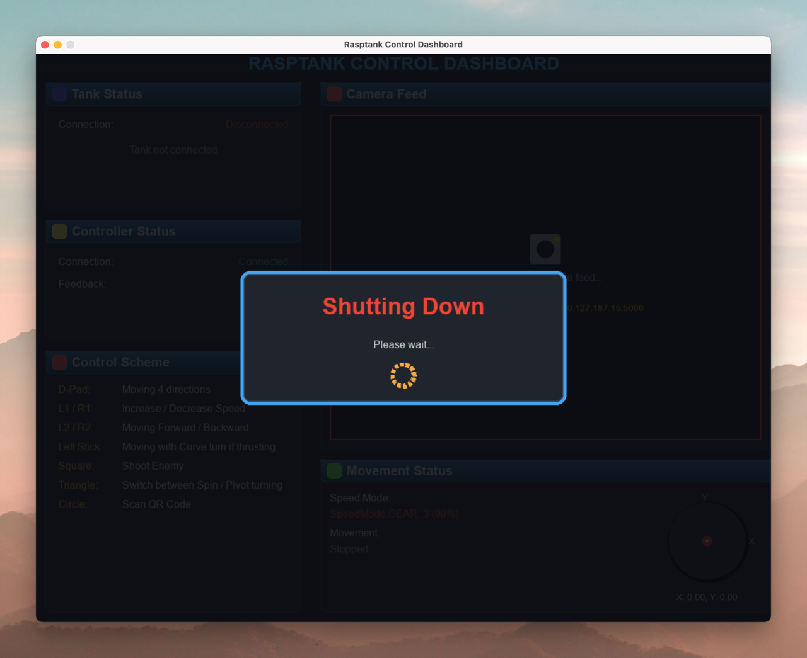
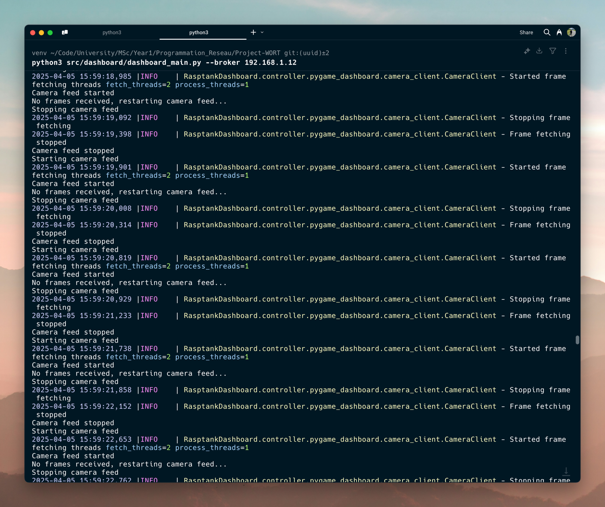

# Project WORT - World of Rasptank

> :warning: **Note:** The screenshots and videos in this README are from early development stages or were captured after returning the Rasptank. As such, they do not fully represent the final capabilities of the project. They are included to give a general idea of the project’s concept, rather than showcasing its full potential.

## 📚 Table of Contents
- [Project WORT - World of Rasptank](#project-wort---world-of-rasptank)
  - [📚 Table of Contents](#-table-of-contents)
  - [Overview](#overview)
    - [*World of Rasptank*](#world-of-rasptank)
  - [Context](#context)
  - [Objectives](#objectives)
  - [Our Achievements](#our-achievements)
    - [Important Features](#important-features)
      - [Rasptank](#rasptank)
      - [Dashboard (Controller Interface)](#dashboard-controller-interface)
      - [Rasptank \<-\> Dashboard Communication](#rasptank---dashboard-communication)
      - [Rasptank \<-\> Game Server Communication](#rasptank---game-server-communication)
    - [Additional Features We Implemented For Fun](#additional-features-we-implemented-for-fun)
      - [Developer Experience](#developer-experience)
      - [Game Server Enhancements](#game-server-enhancements)
      - [Player Experience](#player-experience)
  - [Contributors](#contributors)
  - [In Retrospection](#in-retrospection)

## Overview

This project aims to program a small robot to participate in the *World of Rasptank* game. It is fully developed in Python and is part of the Network Programming course delivered by Alexis Delplace (@AlexisDel)
at the Université Paris-Saclay.

### *World of Rasptank*

  
  <legend>World of Rasptank</legend>

This game involves two teams: a blue team and a red team. Participants are evenly split between the two teams. Each team has a base. The objective is to capture the flag placed in the center of the field and bring it back to your base.

To capture the flag, you must stay in the capture zone for 5 seconds.

:warning: **Important**:

- If you are carrying the flag and get hit, you drop it. The flag then automatically returns to the capture zone.
- If you are hit while capturing the flag, the capture is canceled. You must leave the zone and re-enter it to restart the capture process.

To deposit the flag in your base, scan the QR code located there. A team wins the game by bringing three flags back to their base.

## Context

We had to work in trios and had been provided with a “Rasptank”, a small tracked robot controlled via a Raspberry Pi.

  

## Objectives

The idea for the final evaluation was to participate in a World of Rasptank match. Therefore, it was essential to have a fully operational robot by the end of the course.

## Our Achievements

We have successfully completed the project, and our robot is fully functional. We have implemented all the required features and even added some additional functionalities.

### Important Features

#### Rasptank

- [x] Remotely controllable
- [x] Movement in all directions
- [x] Three speed modes: slow, medium, and fast
- [x] Three turning types: curve, spin and pivot
- [x] Shooting via an infrared emitter
- [x] Detection of hits through an infrared receiver, resulting in tank immobilization for 2 seconds and orange LED blinking.
- [x] Detection of entry into the capture zone (white area) using the line-following module.
- [x] Real-time streaming of webcam video feed*.

(*): The webcam streaming wasn't required but recommended. We did it to enhance our experience and for fun.

  

#### Dashboard (Controller Interface)

We had complete freedom in designing the controller, but it had to allow at least:

- Sending commands to the Rasptank (movements, shots, etc.).
- Viewing the webcam stream.

We chose to create a graphical interface using `pygame`, which runs on a separate computer and connects to a PS5 DualSense controller either via Bluetooth or a wired connection.

- [x] Sending commands to the Rasptank
- [x] Displaying the webcam stream directly in the interface
- [x] Displaying the Rasptank-related information (battery level, speed, etc.)
- [x] Displaying the DualSense controller information (connection status, feedback status, etc.)

  

We also added a shutting down animation for the dashboard when the user closes it.

  

#### Rasptank <-> Dashboard Communication

We had to implement a communication system between the Rasptank and the dashboard. We chose to use the MQTT protocol, which is lightweight and well-suited for IoT applications.

The camera stream is sent via a WebSocket connection, which is more efficient for video streaming. The `pygame` interface gets the stream through HTTP requests and displays it in the dashboard.

#### Rasptank <-> Game Server Communication

We also had to use the MQTT protocol to communicate with the game server. The game server sends the game state and receives the Rasptank's status.

### Additional Features We Implemented For Fun

#### Developer Experience

  

- [x] A well-structured codebase with a clear architecture and separation of concerns.
- [x] Enhanced and extensive logging system for debugging and monitoring.
- [x] Well-formatted and linted code using `black`, `isort`, and `flake8`.
- [x] Pre-commit hooks for automatic code formatting and linting.

#### Game Server Enhancements

- [x] Local broker for all MQTT communication easily executable using `python3 src/broker/broker_main.py`.

#### Player Experience
- [x] A battery level indicator on the dashboard for the Rasptank.
- [x] DualSense controller feedback (vibration) and light bar color change when:
  - the Rasptank is hit
  - the Rasptank is in the capture zone
  - the Rasptank is carrying the flag
  - the Rasptank moves based on the speed mode and turn type
- [x] Fine-tuned the rumble effect of the DualSense controller to match the Rasptank's movement and overall experience.
- [x] QR code scanning on command using `O Button` using the controller.

## Contributors

| First Name | Last Name  | GitHub ID   |
| ---------- | ---------- | ----------- |
| Jewin      | CHENG      | @jewinc     |
| Elie       | KANGA      | @Kg-elie    |
| Mathusan   | SELVAKUMAR | @mathusanm6 |

## In Retrospection

We are very proud of our project and the work we accomplished. We learned a lot about IoT, MQTT, and robotics. It was a lot of fun to work on this project, and we enjoyed the challenge of implementing all the features.

One of our pain points was the duration of the project and the limited time we had to complete it (just 2 weeks). We had to work hard to meet the deadline, but we managed to deliver a fully functional robot.
Secondly, we had to deal with the Rasptank's hardware limitations, which made it challenging to implement some features. We had to be creative and find workarounds to make everything work.
Finally, we had to deal with the game server's limitations, leading to the impossibility to host a World of Rasptank match.

We hope this project encourages future students to explore creative solutions within the constraints of time and resources. With additional time, we would have liked to delve into autonomous navigation or experiment with OpenCV for enhanced object recognition.
